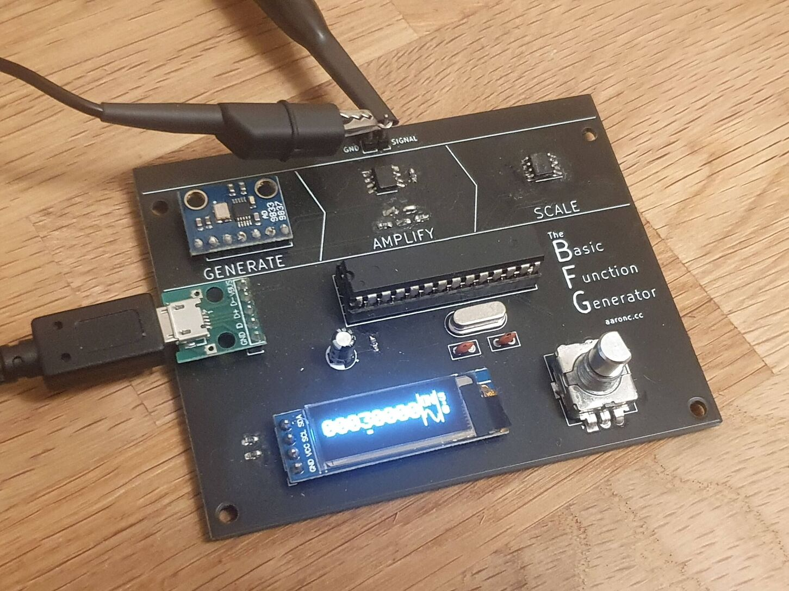
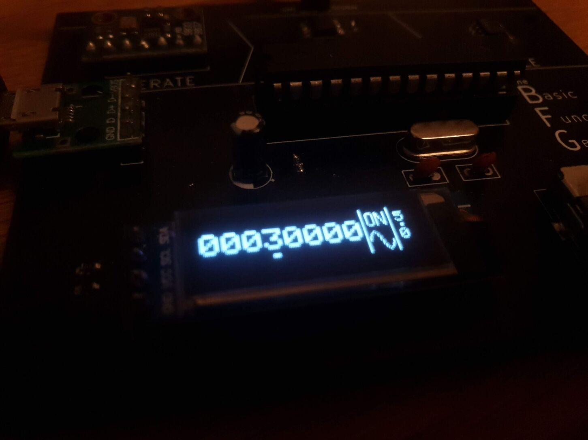
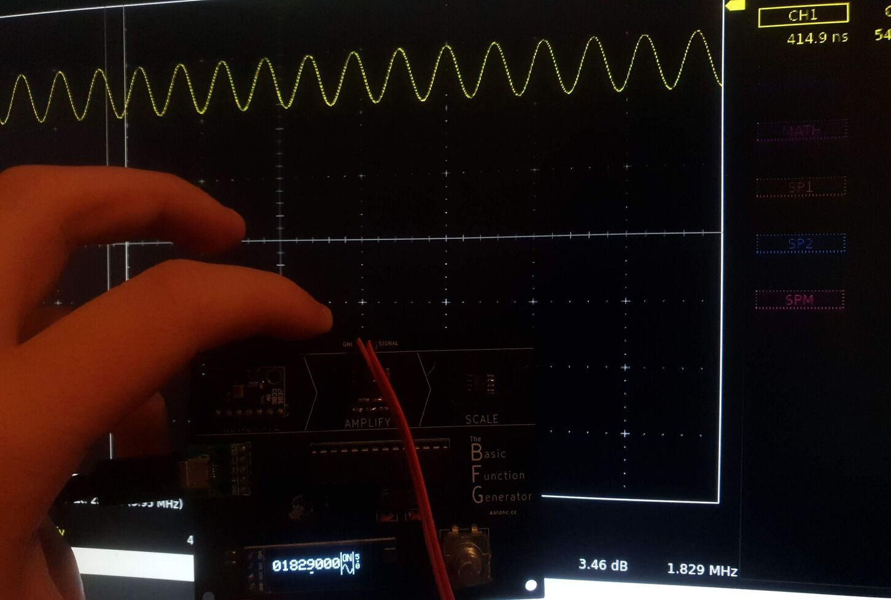

# The BFG - Basic Function Generator

The BFG is a small, minimalistic function generator based around the
[AD9833](https://www.analog.com/media/en/technical-documentation/data-sheets/AD9833.pdf),
controlled by an ATmega328P with a lovely little OLED display and rotary
encoder.

- Sine, square and triangle waves
- Powered over Micro USB
- Output range of 0 to 5 volts
- Theoretical maximum output frequency of 12.5MHz

At high frequencies (>2MHz) the range of voltages begins to narrow; for example,
a sine wave at 5MHz set to an amplitude of 5V only actually oscillates between
about 1.5V and 4V. These frequencies are a tad much for my poor USB oscilloscope
to handle, so I can't accurately measure the practical limits.

I built this for two main reasons:

- To have a basic function generator for embedded projects
- To learn simple surface-mount soldering

# How it Works

As the rather lovely silkscreen on the board suggests, functions are generated
by three steps:

1. **Generate**: The AD9833 generates a low-voltage signal, about 0.65V
2. **Amplify**: The AD8052 op-amp amplifies the signal to 5V
3. **Scale**: The MCP4131 digital potentiometer divides the signal down to the desired amplitude

# Repo

`cad` contains KiCad files for the PCB.

`firmware` contains a platform.io project for the ATmega328P's firmware.